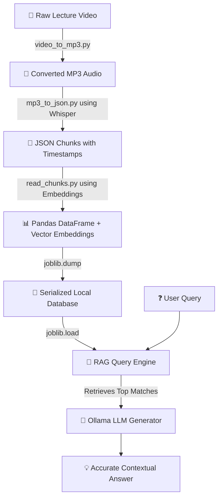
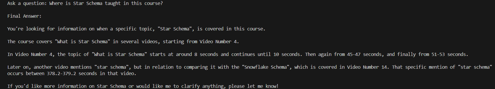

# 🎥 RAG-Based AI Teaching Assistant

[](https://www.python.org/)
[](https://ollama.com/)
[](https://pandas.pydata.org/)
[](https://scikit-learn.org/)
[](https://github.com/openai/whisper)

An intelligent, local Retrieval-Augmented Generation (RAG) system designed to process video lectures, convert speech to structured text with precise timestamps, and enable users to semantically search and ask questions directly to their video content. 

---

## 📌 Features

- **🎥 Automated Lecture Transcription:** Converts video lectures into text transcripts mapped with precise timestamps using OpenAI's Whisper.
- **✂️ Smart Chunking:** Dynamically groups lecture content with contextual metadata to preserve semantic meaning.
- **🔍 Semantic Search & Retrieval:** Uses `mxbai-embed-large` vector embeddings and fast Cosine Similarity to find the exact lecture segment you need.
- **📊 Lightweight Storage:** No heavy database setups needed. Employs optimized Pandas dataframes serialized securely using Joblib.
- **🧠 Local RAG Inference:** Answers context-aware questions locally via Ollama APIs, keeping your data private and free to run.

---

## ⚙️ Tech Stack & Models

| Component | Technology | Role |
| :--- | :--- | :--- |
| **Language** | Python | Core logic & pipeline scripting |
| **Speech-to-Text** | OpenAI Whisper | Audio extraction & timestamped transcription |
| **Embeddings** | `mxbai-embed-large` | Semantic mapping of text chunks into vectors |
| **Search Engine** | Cosine Similarity (Scikit-Learn) | Similarity scoring for retrieval |
| **Data Engine** | Pandas & NumPy | Structuring chunks, metadata, and embeddings |
| **Vector Storage** | Joblib | Serialization and fast storage/loading |
| **LLM Inference** | Ollama (Local LLM API) | Contextual response generation |

---

## 🛠️ System Architecture Flow

Here is how data flows through the RAG Teaching Assistant:



---

## 📂 Project Directory Structure

Ensure your local directory is structured as follows for the scripts to operate successfully:

```text
├── videos/               # Place raw lecture videos (.mp4, .mkv, etc.) here
├── audio/                # Converted MP3 audio outputs
├── json_chunks/          # Transcribed raw JSON text chunks with timestamps
├── database/             # Saved Joblib embeddings dataframes (.pkl)
├── video_to_mp3.py       # Script: Extracts audio from video
├── mp3_to_json.py        # Script: Whisper audio transcription to JSON
├── read_chunks.py        # Script: Generates vector embeddings & database
├── query_engine.py       # Script: Runs RAG query with Ollama
└── requirements.txt      # Project library dependencies
```

---

## 🚀 How to Setup & Use

Follow these steps to run the RAG Teaching Assistant on your own video lectures.

### Step 1: Install Dependencies
Ensure you have Python installed, then install the required Python packages:
```bash
pip install pandas numpy scikit-learn openai-whisper joblib ollama
```
*(Also ensure [Ollama](https://ollama.com/) is installed and running on your local machine, and you have downloaded the embedding model `ollama pull mxbai-embed-large` and your LLM of choice, e.g., `ollama pull llama3`).*

---

### Step 2: Prepare Your Videos
Move all your raw video lecture files (.mp4, .avi, .mkv, etc.) into the `videos/` folder.
```text
videos/
  ├── lecture_1.mp4
  └── lecture_2.mp4
```

---

### Step 3: Convert Video to MP3
Run `video_to_mp3.py` to extract audio tracks from the videos.
```bash
python video_to_mp3.py
```
*This will generate `.mp3` audio files and save them in the `audio/` folder.*

---

### Step 4: Transcribe Audio to JSON Chunks
Run `mp3_to_json.py` to transcribe the audio using Whisper and output structured chunks with timestamps.
```bash
python mp3_to_json.py
```
*Transcripts will be saved as JSON files in the `json_chunks/` directory.*

---

### Step 5: Convert JSON to Vector Database
Run `read_chunks.py` to generate embeddings for all text chunks and save them as a serialized Pandas dataframe.
```bash
python read_chunks.py
```
*This utilizes `mxbai-embed-large` to map semantic representations and exports a `.joblib` (or `.pkl`) file.*

---

### Step 6: Ask Questions via Terminal
Run the query engine script `process_incoming.py` to ask questions and receive console-based answers:
```bash
python process_incoming.py
```

---

### Step 7: Run the Interactive Web UI
For a modern, animated web interface with a side-by-side video transcript browser and context highlighting:
```bash
python -m streamlit run app.py
```
*This opens a browser window displaying the interactive assistant where you can chat and inspect retrieved video blocks.*

---

## 🖥️ Screen Output

Here is what the interface / terminal output looks like in action:



---

## 📄 License
This project is open-source and available under the [MIT License](LICENSE).
